# To-change-character-mesh-and-add-animations

## AIM:
To Change the third person character mesh and add animations

## Procdure:
### Step-1:
Prepare your new character mesh and animations:
### Step-2:
Create or import a new character mesh with its associated skeleton.
### Step-3:
Make sure you have animations for your character, such as idle, walk, run, jump, etc. These animations should be compatible with the new character mesh and have the same skeleton hierarchy.
### Step-4:
Open your project in Unreal Engine Editor.
### Step-5:
Locate the Third Person Character Blueprint:
### Step-6:
In the Content Browser, navigate to the folder where your Third Person Character Blueprint is located. By default, it's usually located in the "Blueprints" folder.
### Step-7:
Open the Third Person Character Blueprint:
### Step-8:
Double-click on the Third Person Character Blueprint to open it in the Blueprint Editor.
### Step-9:
Replace the character mesh:
### Step-10:
In the Blueprint Editor, select the existing character mesh component (usually named "Mesh").
### Step-11:
In the Details panel on the right-hand side, find the "Skeletal Mesh" property.
### Step-12:
Click on the dropdown arrow next to "Skeletal Mesh" and select your new character mesh.
Configure the character skeleton:
### Step-13:
If your new character mesh has a different skeleton from the default Third Person Character Blueprint, you need to set up the new skeleton.
### Step-14:
In the Details panel, find the "Animation Mode" property and set it to "Use Animation Blueprint."
### Step-15:
Click on the dropdown arrow next to "Animation Blueprint" and select or create an animation blueprint that matches your new character's skeleton.
### Step-16:
Assign animations to the animation blueprint:
### Step-17:
If you created a new animation blueprint, open it in the Blueprint Editor.
### Step-18:
Inside the animation blueprint, you can set up the animations for your character.
### Step-19:
Find the "Animation" section or graph, and add animation nodes for each animation you want to use.
### Step-20:
Configure the animation nodes with the appropriate animations for your character.
### Step-21:
Save your changes:
Save the Third Person Character Blueprint and the Animation Blueprint.
### Step-22:
Test the character:
Close the Blueprint Editor and go back to the main Unreal Engine Editor.
### Step-23:
Play the game or simulate it to see the changes you made to the character.

## Output:
### Character:
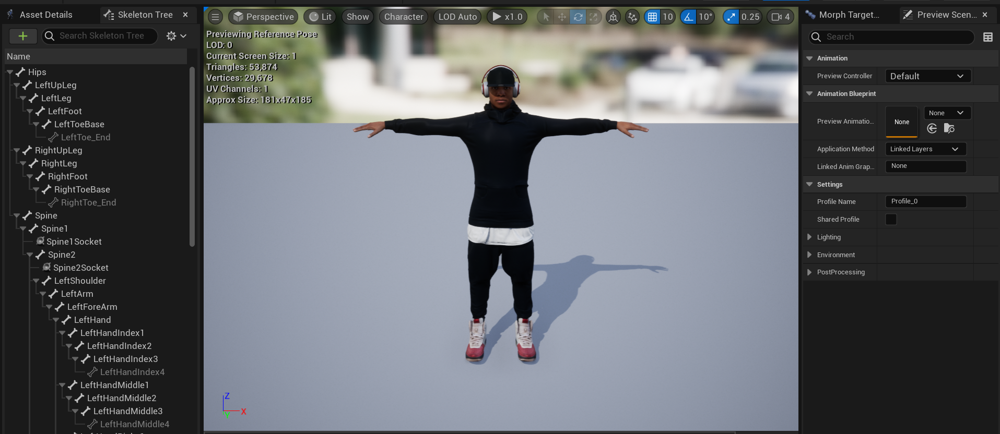
### Animation: State Table and Event Graph:
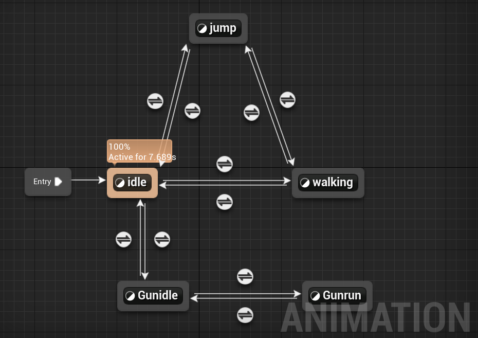
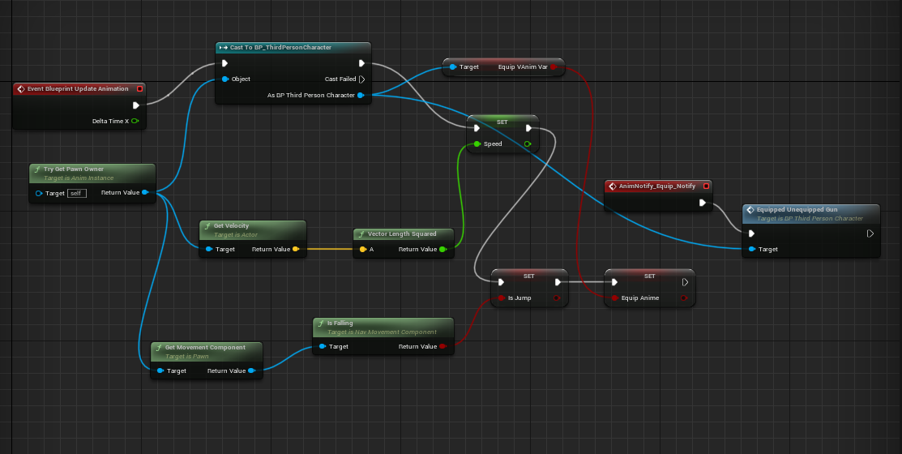

### Animation:
### Ideal to Walking:
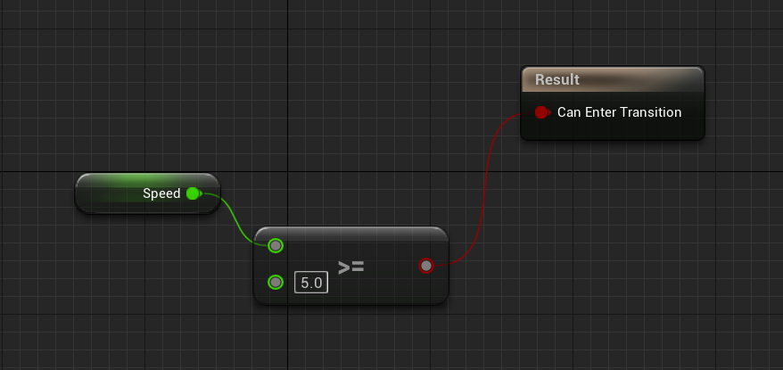
### Walking to Ideal:
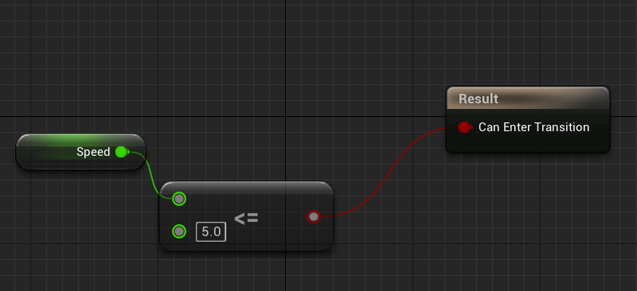
### Ideal to Jump:
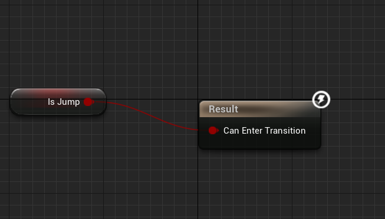
### Jump to Ideal:
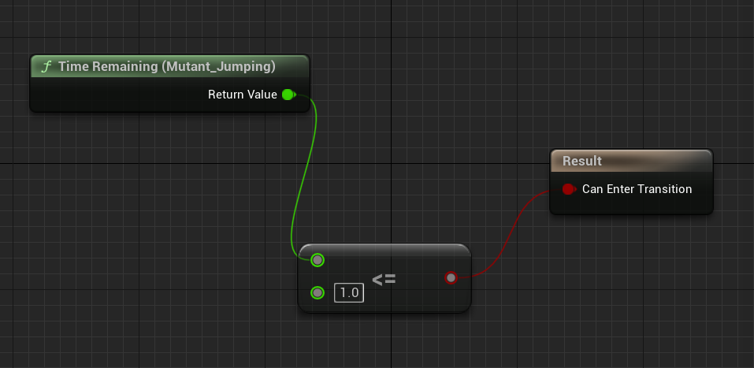
### Jump to Walking:
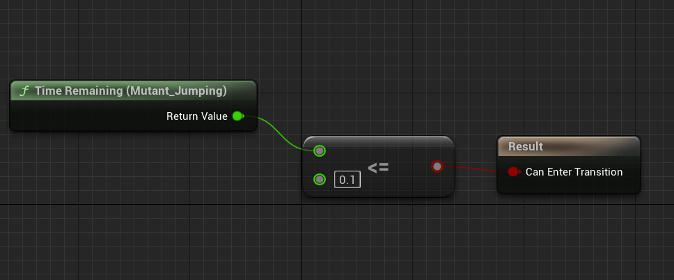
### Walking to Jump:
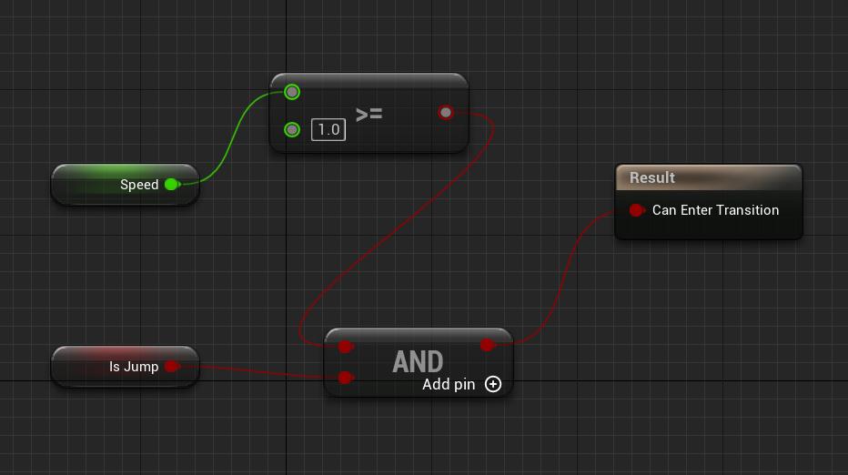

### Animation Montage:
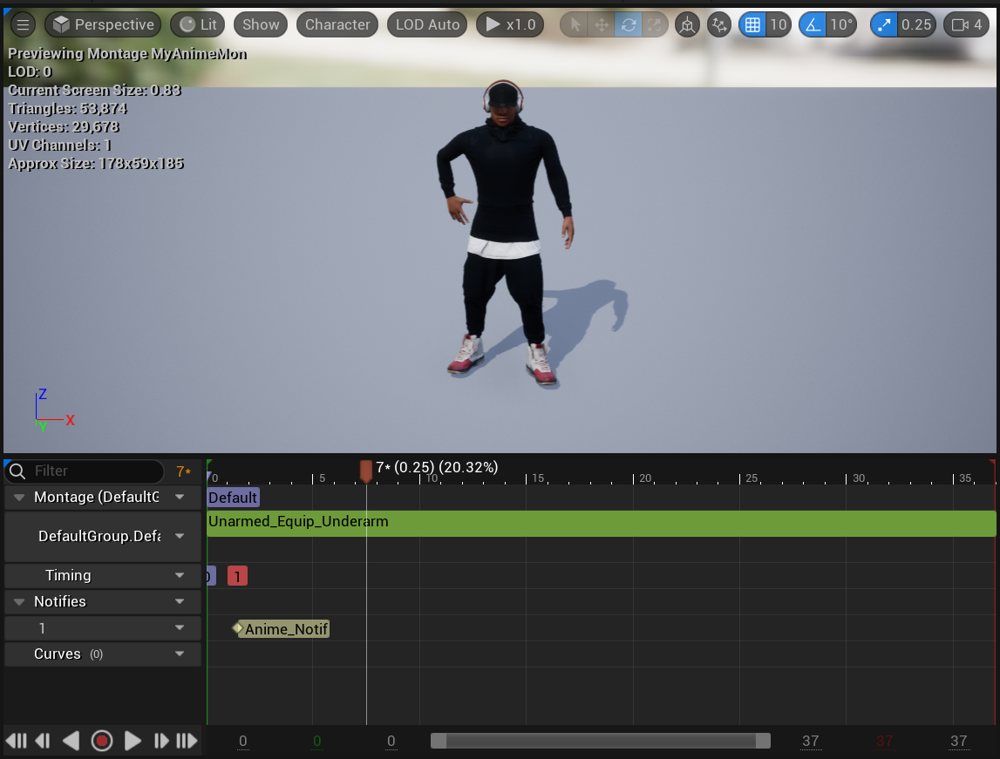

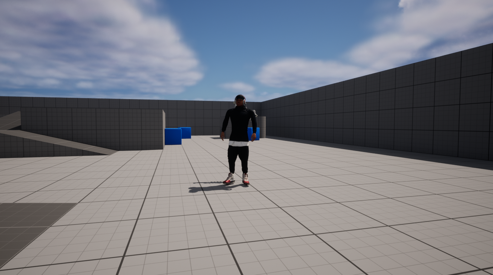

## Result:
To Change the third person character mesh and add animations is implemented successfully.